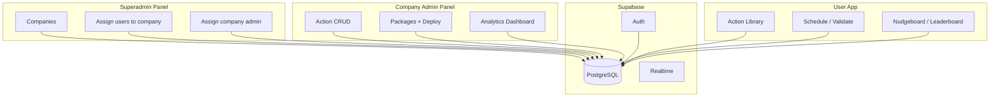

# Nudgeable Action Engine – Implementation Plan (Overview)

**Planning source:** This plan is aligned with [PRODUCT_GUIDE.md](PRODUCT_GUIDE.md). All features, terminology, and UX are derived from the Product & Feature Guide (Core User Features, Behavioral Analytics, Social & Team Dynamics, Admin & Architect Suite, Visual Language).

**Multi-tenant design:** The app is **company-scoped**. See [docs/MULTI_TENANT_DESIGN.md](docs/MULTI_TENANT_DESIGN.md) for: **Companies** (each with users and admin); **Company Admin** (action CRUD, packages, analytics for their company); **Superadmin** (create companies, assign users to company, assign company admin).

**Phase-wise plans:** Each phase has its own plan file in the [plans/](plans/) folder.

---

## Stack and scope

- **Frontend:** Next.js 15 (App Router), TypeScript, Tailwind (**Neo-Brutalism** per Product Guide).
- **Backend:** Supabase (PostgreSQL, Auth, Realtime, Edge Functions).
- **Scope:** Multi-tenant (companies); Phase 1 = Actions + scheduling (company-scoped); Phase 2a = Company Admin (action CRUD, packages, analytics); Phase 2b = Superadmin panel (companies, assign users, assign admin); then Notifications, Social layer, Polish.

---

## Roles (summary)

| Role | Scope | Capabilities |
|------|--------|--------------|
| **Superadmin** | Global | Create companies; assign users to a company; assign user as company admin. |
| **Company Admin** | One company | Action CRUD; create packages; assign packages to users in company; analytics dashboard (company-scoped). |
| **User** | One company | Action Library, schedule, validate, habit loop, Nudgeboard, leaderboard (all company-scoped). |

---

## Phase plan files (implementation order)

| Phase | Plan file | Focus |
|-------|-----------|--------|
| **0** | [plans/PHASE_0_FOUNDATION.md](plans/PHASE_0_FOUNDATION.md) | Foundation + **companies**, profiles (company_id, role), actions (company_id), RLS |
| **1** | [plans/PHASE_1_ACTION_ENGINE.md](plans/PHASE_1_ACTION_ENGINE.md) | Action Library (company-scoped), scheduling, Validation Queue, Habit Loop, Effort Ledger, Leagues |
| **2a** | [plans/PHASE_2a_COMPANY_ADMIN.md](plans/PHASE_2a_COMPANY_ADMIN.md) | **Company Admin:** Action CRUD, packages, Deploy & Enrol, analytics dashboard (company-scoped) |
| **2b** | [plans/PHASE_2b_SUPERADMIN_PANEL.md](plans/PHASE_2b_SUPERADMIN_PANEL.md) | **Superadmin panel:** Companies CRUD, assign users to company, assign company admin |
| **3** | [plans/PHASE_3_NOTIFICATIONS.md](plans/PHASE_3_NOTIFICATIONS.md) | Notifications (bell + list, create on schedule/complete/package assign) |
| **4** | [plans/PHASE_4_SOCIAL_LAYER.md](plans/PHASE_4_SOCIAL_LAYER.md) | Nudgeboard, Leaderboards & Leagues (company-scoped) |
| **5** | [plans/PHASE_5_ADMIN_ANALYTICS.md](plans/PHASE_5_ADMIN_ANALYTICS.md) | Company Admin analytics (Adoption Index, Global Funnel, Skill Drivers, export) – may merge into Phase 2a |
| **6** | [plans/PHASE_6_POLISH.md](plans/PHASE_6_POLISH.md) | Reminders, email/push, Calendar Sync |

---

## Summary table

| Phase | Focus | Key deliverables |
|-------|--------|-------------------|
| 0 | Foundation + multi-tenant | Next.js, Supabase, **companies** table, profiles (company_id, role), actions (company_id), RLS, Auth, seed one company + actions |
| 1 | Actions + scheduling | Action Library (company-scoped); Plan Overlay → Supabase; Validation Queue; Habit Loop; Effort Ledger; Leagues |
| 2a | Company Admin | Action CRUD (company-scoped); packages (company-scoped); Architect Wizard; Deploy & Enrol (company users); analytics dashboard (company-scoped) |
| 2b | Superadmin panel | Companies CRUD; assign users to company; assign user as company admin |
| 3 | Notifications | notifications table; bell + list; create on schedule/complete/package assign |
| 4 | Social layer | Nudgeboard, Leaderboards (company-scoped), Team Pulse |
| 5 | Admin analytics | Adoption Index, Global Funnel, Skill Drivers, export (company-scoped; can be part of 2a) |
| 6 | Polish | Reminders, email/push, Calendar Sync |

---

## Architecture overview

---

## Product Guide checklist (reference)

- **Core User Features:** Action Library (Challenges), Intention & Planning (Plan Overlay, Calendar Sync +2 XP), Validation Queue (Verify Impact, Impact Notes), Habit Loop (Rep Loops, Cementing, Rule of 5).
- **Behavioral Analytics:** Engagement Funnel, Effort Ledger, Leagues (Starter–Diamond).
- **Social & Team:** Nudgeboard, Leaderboards & Leagues.
- **Admin & Architect Suite:** Analyze Change (Adoption Index, Global Funnel, Skill Drivers); Control Panel – Architect Content, Pulse Logic, Deploy & Enrol; **Custom Action Architect** (Action CRUD by company admin).
- **Visual Language:** Neo-Brutalism.

---

Implement in order: [plans/PHASE_0_FOUNDATION.md](plans/PHASE_0_FOUNDATION.md) → [plans/PHASE_1_ACTION_ENGINE.md](plans/PHASE_1_ACTION_ENGINE.md) → [plans/PHASE_2a_COMPANY_ADMIN.md](plans/PHASE_2a_COMPANY_ADMIN.md) → [plans/PHASE_2b_SUPERADMIN_PANEL.md](plans/PHASE_2b_SUPERADMIN_PANEL.md) → then Notifications, Social, Analytics, Polish.
