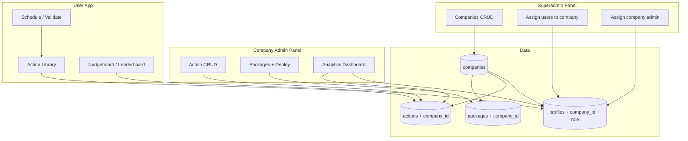

# Multi-Tenant Design: Companies, Company Admin, Superadmin

**Goal:** Multiple companies; each company has its own users and admin(s). **Company Admin** handles action CRUD, packages, and analytics for their company. **Superadmin** manages companies, assigns users to companies, and assigns company admins.

---

## 1. Roles and hierarchy

| Role | Scope | Capabilities |
|------|--------|--------------|
| **Superadmin** | Global | Create companies; assign users to a company; assign a user as company admin; (optional) view all companies) |
| **Company Admin** | One company | Action CRUD (create, read, update, delete actions for their company); create packages; assign packages to users in their company; analytics dashboard (company-scoped) |
| **User** | One company | Use Action Library, schedule, validate, habit loop, Nudgeboard, leaderboard (all scoped to their company) |

- Each **user** belongs to exactly one **company** (or none until assigned by superadmin).
- Each **company** has one or more **admins** (users with `role = 'admin'` and that `company_id`).
- **Superadmin** has `role = 'superadmin'` and no `company_id` (or a special “global” flag).

---

## 2. Data model

### 2.1 Companies

```sql
CREATE TABLE companies (
  id UUID DEFAULT gen_random_uuid() PRIMARY KEY,
  name TEXT NOT NULL,
  slug TEXT UNIQUE,                    -- optional, for URLs
  created_by UUID REFERENCES auth.users(id),  -- superadmin who created it (profile may not exist yet)
  created_at TIMESTAMPTZ DEFAULT NOW(),
  updated_at TIMESTAMPTZ DEFAULT NOW()
);
```

### 2.2 Profiles (extended)

- **company_id** (FK to companies, nullable): user’s company. Null for superadmin until assigned to a company (superadmin usually has no company).
- **role**: `'superadmin' | 'admin' | 'user'`.
  - **superadmin**: global; no company_id (or ignore company_id).
  - **admin**: company admin; must have company_id; can manage that company’s actions, packages, users (for package assignment), and see company analytics.
  - **user**: regular member; must have company_id; sees only their company’s actions, feed, leaderboard.

```sql
-- Add to existing profiles table:
ALTER TABLE profiles ADD COLUMN company_id UUID REFERENCES companies(id) ON DELETE SET NULL;
ALTER TABLE profiles ADD COLUMN role TEXT DEFAULT 'user' CHECK (role IN ('superadmin', 'admin', 'user'));
-- Optional: unique constraint so an admin is per company (one row per user)
```

### 2.3 Actions (company-scoped)

- **company_id** (FK to companies, nullable): which company this action belongs to. If null, treat as “template” or omit (recommend: every action has a company_id so company admin owns CRUD).

```sql
ALTER TABLE actions ADD COLUMN company_id UUID REFERENCES companies(id) ON DELETE CASCADE;
-- RLS: users see actions where company_id = their profile.company_id; admins of that company can CRUD.
```

### 2.4 Packages (company-scoped)

- **company_id** (FK to companies): package belongs to a company; only that company’s admins can create/edit and assign to users in that company.

```sql
ALTER TABLE packages ADD COLUMN company_id UUID REFERENCES companies(id) ON DELETE CASCADE;
```

### 2.5 User actions, feed_events, notifications

- No need to add `company_id` to these; **user_id** is enough. Scoping is done by:
  - **user_actions**: user belongs to a company; actions are company-scoped; so effectively user_actions are scoped by (user’s company, action’s company).
  - **feed_events**: only show events for users in the same company (join profiles and filter by company_id).
  - **notifications**: per user; no change.

### 2.6 RLS (summary)

- **companies**: Superadmin can CRUD; company admins can read their own company; users can read their own company.
- **profiles**: Users read/update own profile; superadmin can update any (assign company_id, role); company admin can read profiles where company_id = their company (for assign package, assign admin).
- **actions**: Insert/update/delete only by company admin for that company (or superadmin); read by any user in that company.
- **packages**: Same as actions (company-scoped; admin of that company + superadmin).
- **user_actions, feed_events**: Read/insert by user for self; company-scoped reads via “users in my company” when needed.

---

## 3. Superadmin panel

**Routes:** e.g. `/superadmin` (only `role = 'superadmin'`).

**Features:**

1. **Companies**
   - List companies (table/cards).
   - Create company (name, optional slug).
   - Edit company (name, slug).
   - (Optional) Deactivate/delete company.

2. **Assign users to company**
   - List users (from profiles) with current company_id and role.
   - “Add to company”: pick user (by email or search), pick company → set `profiles.company_id` for that user.
   - “Remove from company”: set `profiles.company_id` = null (user can’t see company-specific content until assigned again).

3. **Assign company admin**
   - For a given company, list users in that company.
   - “Set as admin”: set `profiles.role = 'admin'` for that user (and ensure `profiles.company_id` = that company).
   - “Remove admin”: set `profiles.role = 'user'` for that user.

**UI:** Simple tables/forms; Neo-Brutalist style. No need for complex wizard here.

---

## 4. Company Admin panel (Architect Suite)

**Routes:** e.g. `/admin` (allowed for `role = 'admin'` and `role = 'superadmin'`; for admin, scope to their `company_id`).

**Features:**

1. **Action CRUD**
   - List actions for their company (`actions.company_id = my company_id`).
   - Create action: theme, title, how, why, points, time_estimate; set `company_id` = current user’s company.
   - Edit action: same fields; only if action.company_id = user’s company.
   - Delete action: only if action.company_id = user’s company (soft delete or hard delete; consider impact on user_actions).

2. **Packages**
   - Create package (name, description, start_date, duration_weeks, delivery_time, actions_per_week, rule_of_five); set `company_id`.
   - Select actions from **their company’s** action bank; add to package_actions.
   - Deploy & Enrol: select users from **their company** (profiles where company_id = my company_id); set scheduled_start_date; create package_assignments and user_actions.

3. **Analytics dashboard**
   - All metrics scoped to their company: users (profiles where company_id = my company_id), actions (company_id = my company), adoption index, funnel, skill drivers, export (company data only).

---

## 5. User experience (company-scoped)

- **Action Library:** Only actions where `company_id = my profile.company_id`.
- **Nudgeboard / Leaderboard:** Only feed_events / leaderboard for users in same company (join profiles, filter by company_id).
- **Notifications:** Unchanged (per user).
- If user has **no company_id** (e.g. new signup before superadmin assigns): show “You are not assigned to a company yet” and hide company-scoped content, or redirect to a “pending” page.

---

## 6. Phase impact (summary)

| Phase | Change |
|-------|--------|
| **0** | Add `companies` table; add `company_id`, `role` to profiles; add `company_id` to actions; RLS for companies and company-scoped actions; trigger/create profile on signup (company_id null, role 'user'). Seed: create one company and seed actions with that company_id, or seed companies and then seed actions. |
| **1** | Action engine and scheduling: filter actions by user’s company_id; user_actions unchanged (user_id); validation queue and habit loop unchanged. |
| **2** | **Split:** (A) **Company Admin:** Action CRUD (company-scoped), packages (company-scoped), assign packages to company users; (B) **Superadmin panel:** Companies CRUD, assign users to company, assign company admin. |
| **3–4** | Notifications and social: Nudgeboard/leaderboard filter by company_id (same company only). |
| **5** | **Company Admin analytics:** Dashboard scoped to company (users, actions, funnel, export). Superadmin can have optional “global” analytics (all companies) later. |
| **6** | Polish; optional superadmin “view all companies” analytics. |

---

## 7. Architecture diagram



---

This document is the source of truth for the multi-tenant redesign. Implementation plan and phase files should reference it and implement accordingly.
